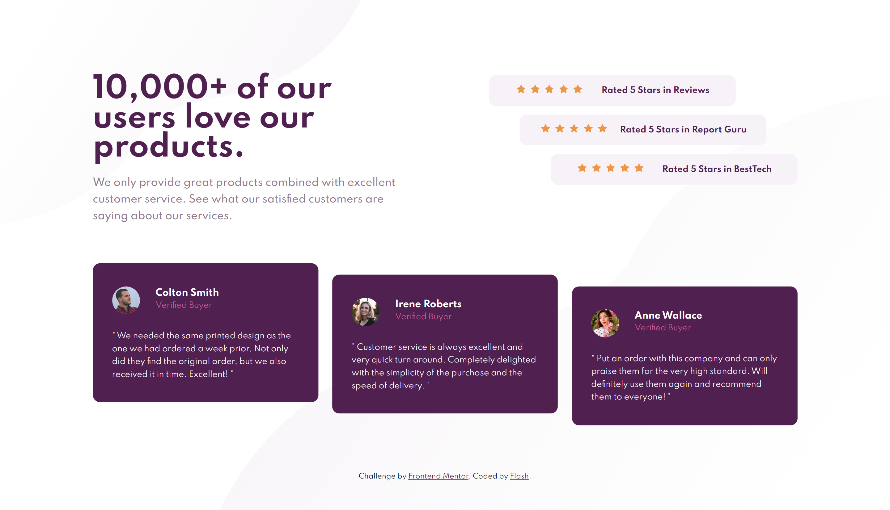
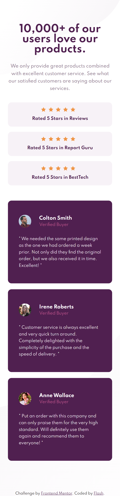

# Frontend Mentor - Social proof section solution

This is a solution to the [Social proof section challenge on Frontend Mentor](https://www.frontendmentor.io/challenges/social-proof-section-6e0qTv_bA). Frontend Mentor challenges help you improve your coding skills by building realistic projects. 

## Table of contents

- [Overview](#overview)
  - [The challenge](#the-challenge)
  - [Screenshot](#screenshot)
  - [Links](#links)
- [My process](#my-process)
  - [Built with](#built-with)
  - [What I learned](#what-i-learned)
- [Author](#author)

## Overview

### The challenge

Users should be able to:

- View the optimal layout for the section depending on their device's screen size

### Screenshot

### Links

- Solution URL: [www.frontendmentor.io/solutions/mobile-first-design-of-social-proof-section-using-scss-OqGjHxfGZ](https://www.frontendmentor.io/solutions/mobile-first-design-of-social-proof-section-using-scss-OqGjHxfGZ)
- Live Site URL: [flash54.github.io/SocialProofSection](https://flash54.github.io/SocialProofSection/)

## My process

### Built with

- Semantic HTML5 markup
- SCSS
- Flexbox
- CSS Grid
- Mobile-first workflow

### What I learned

I tried doing mobile first design but then realised later that for this particular project, media queries for mobile would be way lesser compared to the same for desktop. Still continuec cause i realised it after completing 80% of it and did'nt wanna start from scratch.

## Author

- Website - [flash54.github.io](https://flash54.github.io/)
- Frontend Mentor - [@flash45](https://www.frontendmentor.io/profile/flash45)
